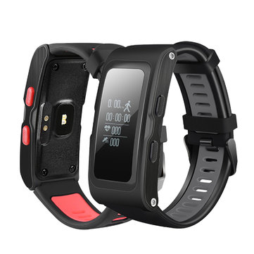
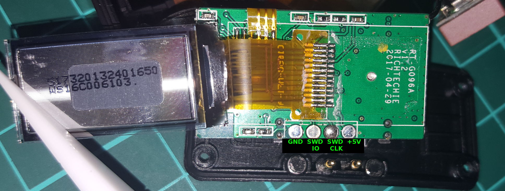
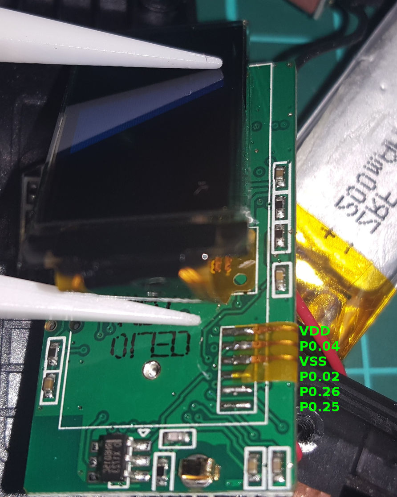
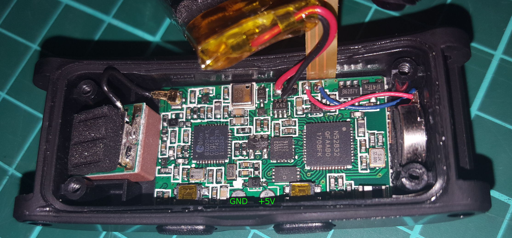

### Taida Century nRF52 mini board / nRF52832 Gold Core

The T28 is a nRF52832 based smart watch with onboard GPS, Barometer, Accelerometer and optical HRM (PPG). The T28 is available from several online retailers under a variety of brand names; Mindkoo/LEMDIOE/DOITOP/NIYOQUE to name a few.

This board is supported by Sandeep Mistry's nRF5 core, through the following smartwatch variant 
[T28 variant.h](https://github.com/micooke/arduino-nRF5-smartwatches/blob/master/variants/T28/variant.h).

| peripheral type         | name       | pin          | T28
| :---:                   | :---:      | :---:        | :---: 
| accelerometer           | Kx023      | SCL          | 16
|                         |            | SDA          | 13
| optical HR sensor       | Si1143?    | SCL          | ?
|                         |            | SDA          | ?
|                         |            | INT          | ?
|                         |            | LED          | 9
| OLED Character ROM      | GT24L24A2Y | MISO         | 19
|                         |            | MOSI         | 23
|                         |            | SCK          | 22
|                         |            | CE           | 21
| OLED                    | ---        | MISO         | n/a
|                         | ---        | MOSI         | 18
|                         | ---        | SCK          | 17
|                         | ---        | RST          | 14
|                         | ---        | CS           | 28
|                         | ---        | DC           | 30
|                         | ---        | VPP          | 1
| GPS					  | G7020-KT   | Tx           | 31
|                         | (ublox)    | Rx           | 11
| Altitude/Pressure/Temp  | HP203B     | SCL          | ?
|                         |            | SDA          | ?
| side tactile button     | (top)      | BUTTON1      | 20
| side tactile button     | (bottom)   | BUTTON2      | 24
| capacitive touch button | RH6015C    | BUTTON3      | 2
| vibrate motor           | ---        | VIBRATE -or- | 10
|                         |            | LED_BUILTIN  | 
| serial UART \*          | ---        | Tx           | 26
|                         |            | Rx           | 25
| battery voltage level   | ---        | ---          | ?

\* There are no dedicated UART pins broken out. I chose two solder pads near the OLED connector as Tx,Rx.

### I2C addresses
1. 0x1F : Accelerometer (Kx022/Kx023)
2. 0x5A : Heart Rate Sensor / PPG (Si1143)
3. 0x76 : Altitude / Pressure / Temperature (HP203B)

### Images

### downloads
* <a href="nRF52832_Lemdoie_T28/SH1107V2.1.pdf" download>SH1107 datasheet</a>
* <a href="nRF52832_Lemdoie_T28/SH1107_64x128_ProductSpec.pdf" download>SH1107 64x128 OLED Product Sheet</a>
* <a href="nRF52832_Lemdoie_T28/GT24L24A2Y_Chinese.pdf" download>GT24L24A2Y SPI OLED ROM (Chinese)</a>
* <a href="nRF52832_Lemdoie_T28/GT24L24A2Y_EnglishTranslated.pdf" download>GT24L24A2Y SPI OLED ROM (English auto-translated)</a>

[micooke.github.io](./)
