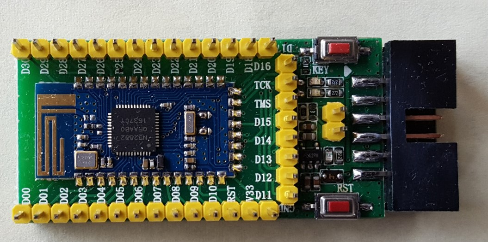
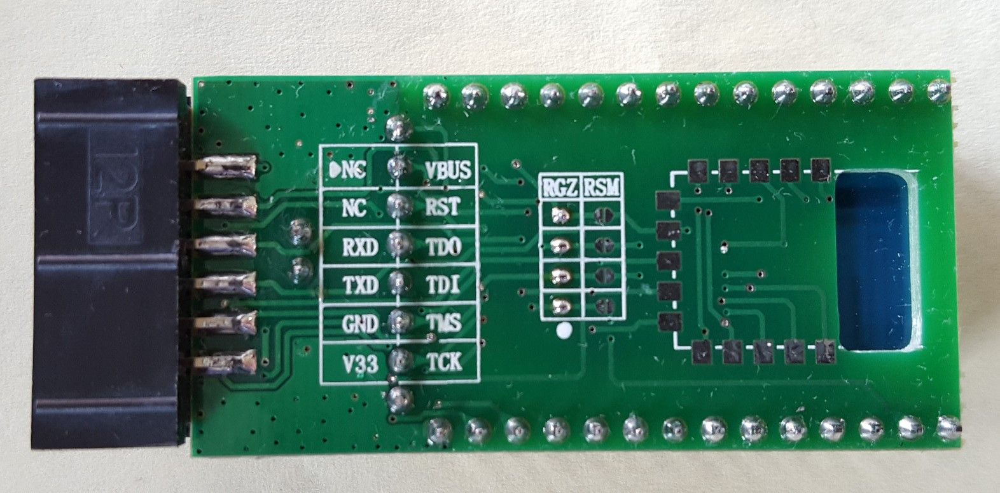
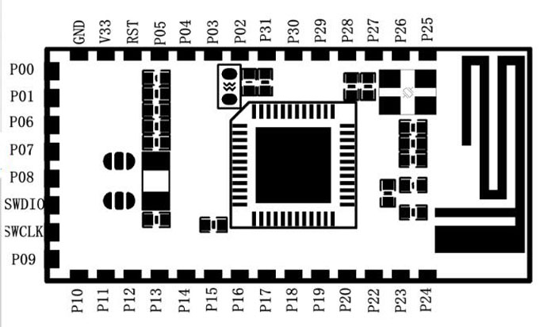

### Taida Century nRF52 mini board / nRF52832 Gold Core


The Taida Century nRF52 mini board / nRF52832 Gold Core development board is available from several online retailers and is similarly priced to the [SparkFun nRF52832 Breakout](https://www.sparkfun.com/products/13990), or a smaller (and cheaper) alternative of the Nordic [nRF52 DK](https://www.nordicsemi.com/eng/Products/Bluetooth-low-energy/nRF52-DK).

This board is supported by Sandeep Mistry's nRF5 core, through the following variant 
[Taida_Century_nRF52_minidev variant.h](https://github.com/sandeepmistry/arduino-nRF5/tree/master/variants/Taida_Century_nRF52_minidev/variant.h).

The development board itself is a nRF52832 breakout module, smd soldered to a generic development board. The development board was designed for the CC2640, and appears to be compatable with select breakout modules containing the following chipsets :  CC2640, nRF52832, nRF51822.

According to the schematics below the generic development board is a ```CC2640RSM/RGZ Module Test Board V1.0``` from ```rf-smart.taobao.com```.

#### RGZ configuration - solder J11 to J14
* TX = DIO3
* RX = DIO2
* TDO = DIO16
* TDI = DIO17

#### RSM configuration - solder J15 to J18
* TX = DIO2
* RX = DIO1
* TDO = DIO3
* TDI = DIO4

### Pin allocation

| peripheral    | Arduino #define      | configuration | GPIO
| :---:         | :---:                | :---:         | :---: 
| KEY Button    | PIN_BUTTON1          | --            | 9
| RST Button    | PIN_BUTTON2          | --            | 31
| LED1 (top)    | PIN_LED1/LED_BUILTIN | --            | 5
| LED2 (bottom) | PIN_LED2             | --            | 6
| MISO          | PIN_SPI_MISO/MISO    | --            | 21
| MOSI          | PIN_SPI_MOSI/MOSI    | --            | 22
| SCK           | PIN_SPI_SCK/SCK      | --            | 23
| SS            | SS                   | --            | 20
| TX            | PIN_SERIAL_TX        | None          | 3
| RX            | PIN_SERIAL_RX        | None          | 2
| SDA           | PIN_WIRE_SDA/SDA     | None          | 2
| SCL           | PIN_WIRE_SCL/SCL     | None          | 3
| TX            | PIN_SERIAL_TX        | RGZ           | 3
| RX            | PIN_SERIAL_RX        | RGZ           | 2
| SDA/TDO **    | PIN_WIRE_SDA/SDA     | RGZ           | 16
| SCL/TDI **    | PIN_WIRE_SCL/SCL     | RGZ           | 17
| TX            | PIN_SERIAL_TX        | RSM           | 2
| RX            | PIN_SERIAL_RX        | RSM           | 1
| SDA/TDO **    | PIN_WIRE_SDA/SDA     | RSM           | 3
| SCL/TDI **    | PIN_WIRE_SCL/SCL     | RSM           | 4
* Pin allocation for SPI and I2C reflective of the variant.h as of 6/10/2017 
** TDO/TDI are not available/used by the nRF5x series, so have been repurposed as SDA/SCL

### Images




### downloads

* <a href="nRF52832_TaidaCentury_GoldCore/NRF52832 Core Board V1.0.pdf" download>NRF52832 module schematic</a>
* <a href="nRF52832_TaidaCentury_GoldCore/NRF52832 Module Test Board V1.0.pdf" download>NRF52832 module breakout board schematic</a>
* <a href="nRF52832_TaidaCentury_GoldCore/S132_SDS_v2.0.pdf" download>S132 SoftDevice v2.0 Specification</a>

[micooke.github.io](./)
